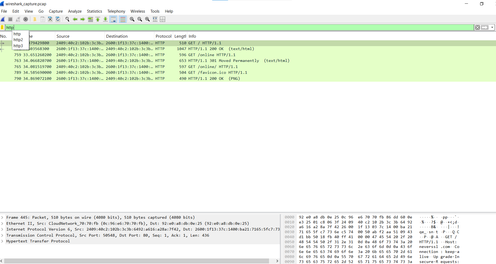
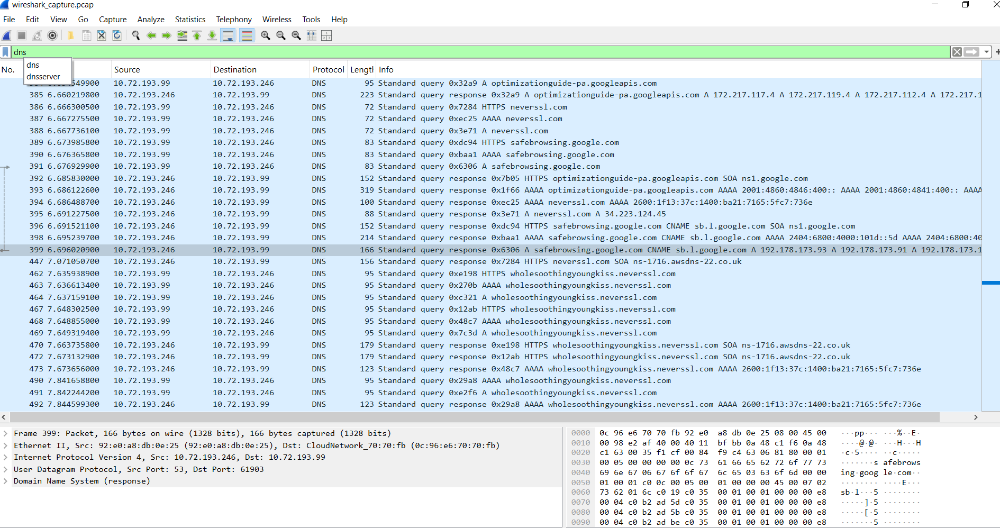
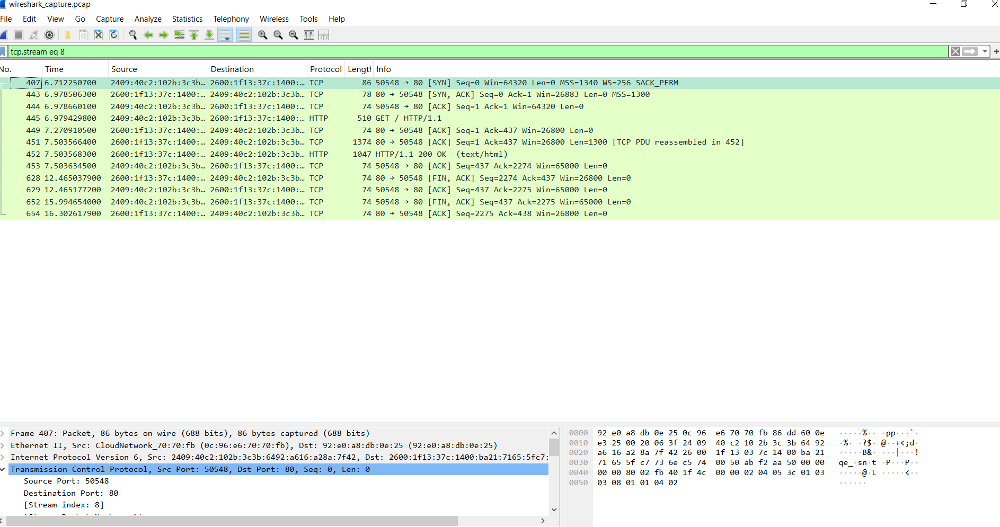
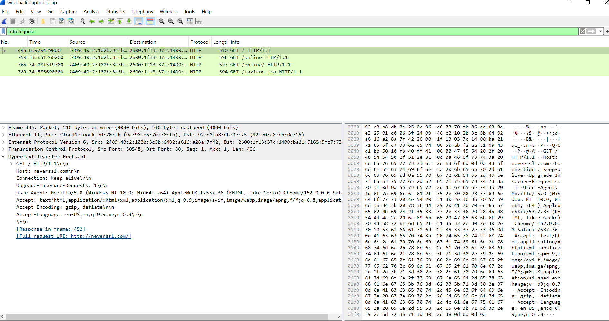

# Network Traffic Analysis with Wireshark

## Objective

This project captures and analyses network traffic from my own device and authorised network using Wireshark.

## Scope and Ethics

- Target: My own laptop and network connection
- Capture duration: More than 2 minutes
- I did not capture traffic from public Wi-Fi or any network without permission.

## Filters Used

- `http` - To view HTTP traffic
- `dns` - To view DNS traffic
- `tcp` - To analyse TCP traffic
- `http.request` - To identify an HTTP GET request

## TCP Three-Way Handshake

A TCP connection starts with three steps:

1. SYN: The client requests a connection.
2. SYN-ACK: The server accepts and acknowledges the request.
3. ACK: The client acknowledges the server, and the connection is established.

## Security Observation

An HTTP GET request can expose data such as the requested web page address and host name because HTTP is not encrypted. HTTPS protects communication by using TLS encryption, which makes it much harder for an attacker to read data while it travels across a network.

## Glossary

- **Packet:** A small unit of data sent across a network.
- **Protocol:** A set of rules used by devices to communicate.
- **Port:** A numbered communication endpoint used by a service or application.
- **Payload:** The actual data carried inside a network packet.
- **Handshake:** The initial exchange of messages used to establish a connection.
  
  ## Screenshots

### HTTP Traffic Filter

### DNS Traffic Filter

### TCP Three-Way Handshake

### Unencrypted HTTP GET Request

## Files

- `wireshark_capture.pcap` - Captured network traffic
- `http_filter.png` - HTTP filter screenshot
- `dns_filter.png` - DNS filter screenshot
- `tcp_handshake.png` - TCP handshake screenshot
- `http_get_packet.png` - HTTP GET request screenshot

## Author

[AKANKSHA PATIL]
